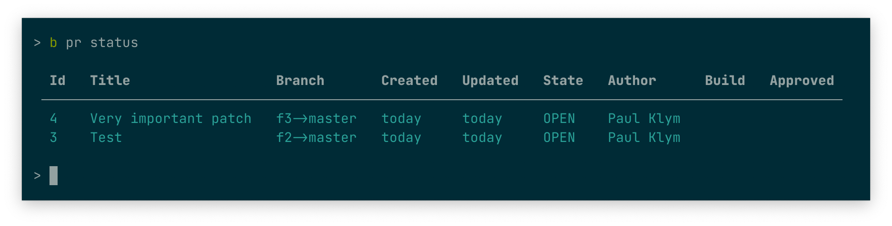

# bb

Bitbucket's command line tool

> It's like `gh` ([GitHub's CLI](https://github.com/cli/cli)) but for BitBucket

This tools is very basic but it does all what I need at the moment (though I am happy to accept PRs)



## Installation

```sh
pip3 install bb-cli
```

## Auth

At the moment the only way it works is by `App passwords` auth: [https://bitbucket.org/account/settings/app-passwords/](https://bitbucket.org/account/settings/app-passwords/)

> For this you need to have 2FA enabled

At first launch, `bb` will ask for user and password that you generated at bitbucket and write to `~/.config/bb/conf.py`. That's plain python file and you can use it to store information securely:

```python
import os

pswd = os.popen("pass show ep/bb-cli | head -n 1").read().strip()
user = os.popen("pass show ep/bb-cli | grep username").read().strip().split(" ")[-1]

AUTH = (user, pswd)
```

## Usage

```sh
> bb pr --help
Usage: bb pr [OPTIONS] COMMAND [ARGS]...

  Manage pull requests

Options:
  --help  Show this message and exit.

Commands:
  approve          Approve PR by ID
  checkout         Checkout PR by ID
  comments         View comments for PR by ID
  commits          View commits of PR by ID
  create           Create new PR
  decline          Decline PR by ID
  diff             Show diff by PR ID
  list             List all PRs
  merge            Merge PR by ID
  request-changes  Request changes for PR by ID
  status           Shows more detailed information about PRs (Build,...
```

## Example

```sh
git checkout -b test-bb
echo Changes > file.txt
git add file.txt
git commit -m 'New very important patch'

# push current branch to remote and create PR
bb pr create

bb pr status

bb pr merge 1
```
